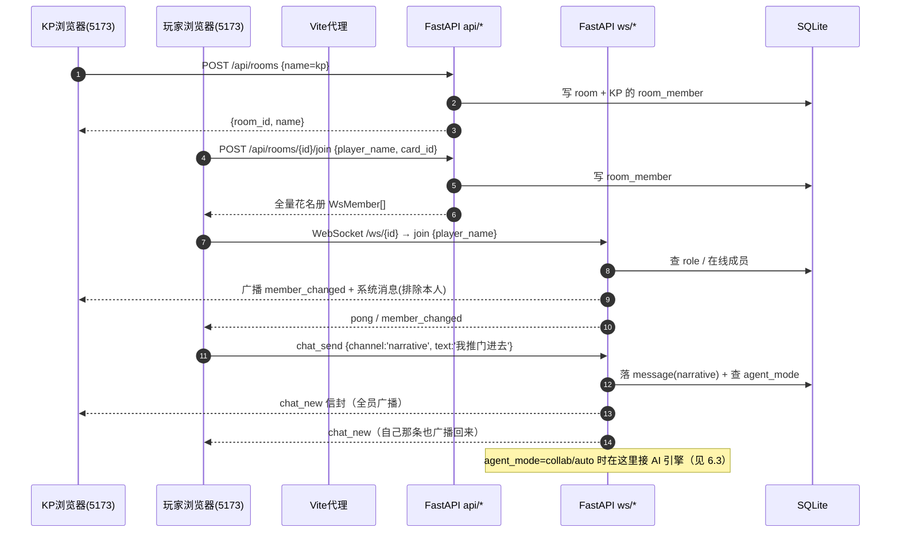
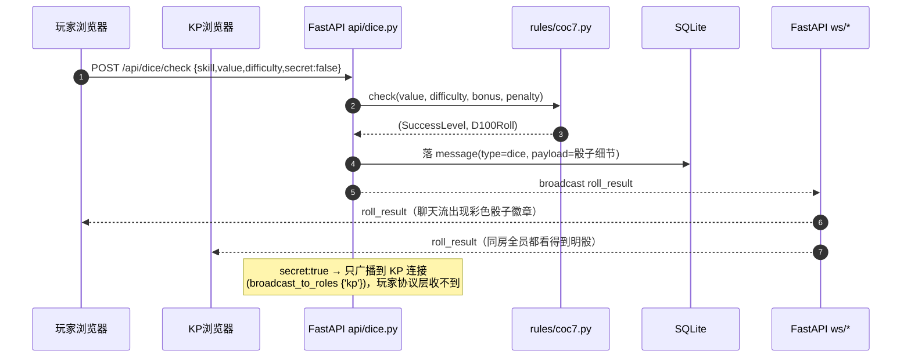
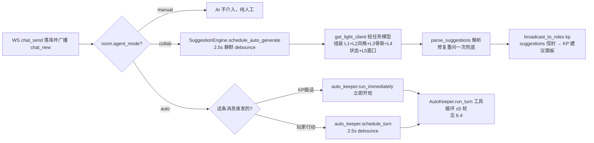
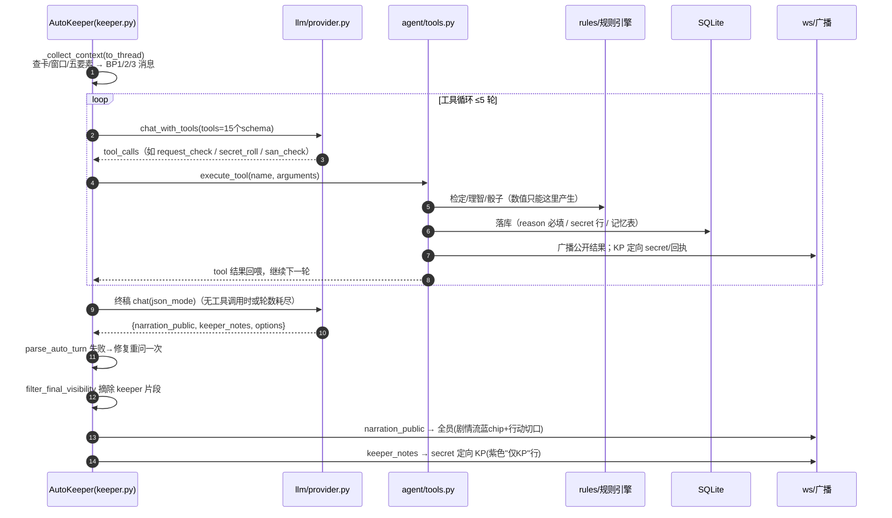
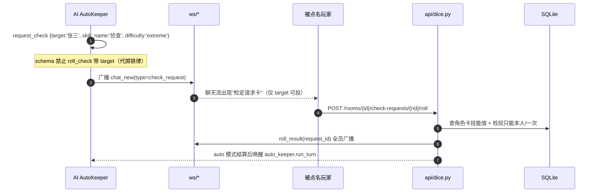
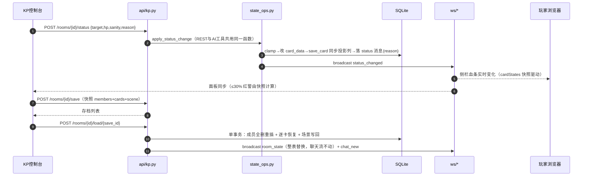

# 项目目前结构与细节介绍

---

## 0. 读前导航（强烈建议按顺序读代码）

| 顺序 | 看什么 | 解决什么问题 |
| --- | --- | --- |
| 1 | 根目录 `goal.md` §3~§8 | 技术栈定案、架构图、数据模型规划、分阶段清单（带验收记录），是"为什么这么写"的权威答案 |
| 2 | `project/backend/app/main.py` + `app/models.py` | 后端入口挂载了哪些路由、整库 15 张表长什么样 |
| 3 | `project/backend/app/api/*` + `app/ws/*` | REST 端点与 WebSocket 协议（消息 type 全集） |
| 4 | `project/frontend/src/types/ws.ts` + `stores/room.ts` | 前后端消息协议怎么对齐、房间会话状态怎么维护 |
| 5 | `project/frontend/src/views/` + `components/ChatStream.vue` | 玩家房 / KP 控制台 / 聊天渲染 |
| 6 | `project/backend/app/agent/*` + `app/llm/*` | AI 主持（协同建议 / 全自动）与 LLM 接入（本项目的灵魂，也最绕） |

一句话定位：**这是一个"规则引擎权威、AI 无写权、服务端广播驱动前端"的联机跑团系统**。前端几乎不做本地计算，所有状态由后端裁定后经 WS 广播，前端"收到什么渲染什么"。

---

## 1. 系统架构总览

### 1.1 技术栈

| 层 | 选型 | 说明 |
| --- | --- | --- |
| 前端 | Vue 3（rc）+ Vite 8 + TypeScript + Pinia + vue-router 5 + Element Plus | `npm run dev` 跑在 5173 |
| 后端 | Python FastAPI 0.141 + uvicorn | 唯一权威状态源，8000 端口 |
| 数据库 | SQLite + SQLModel（`backend/data/coc.db`） | 零部署，建卡/房间/消息/记忆全落本地文件 |
| LLM | OpenAI 兼容适配层（openai SDK 3.8） | 千问 / 智谱 GLM / DeepSeek / OpenAI 可切换，可离线降级 |
| 实时 | 原生 WebSocket（FastAPI） | 无 seq 增量协议，断线用全量 `room_state` 补齐 |

### 1.2 总体架构（开发模式：前后端分离）

```
┌────────────── 浏览器（多标签 = 玩家×N + KP×1）──────────────┐
│  Vue3 SPA  http://127.0.0.1:5173                            │
└───────┬────────────────────────────┬────────────────────────┘
        │ HTTP(REST)  Vite 代理 /api   │ WS  Vite 代理 /ws（必须 ws:true）
        ▼                             ▼
┌──────────────────── FastAPI 后端（:8000）────────────────────┐
│  main.py（lifespan 起心跳踢除协程 / CORS / 挂 5 组 REST + WS）│
│  api/cards·dice·rooms·kp·suggestions   ← REST 裁定层          │
│  ws/rooms + ws/manager                ← WS 连接·广播·定向 KP  │
│  agent/*  AI 主持（提示词组装·工具循环·记忆·防剧透）           │
│  llm/*    OpenAI 兼容客户端（主/轻双档·Mock·用量统计）         │
│  rules/*  纯函数规则引擎（检定·理智·职业点）                   │
│  models.py → SQLite coc.db（15 张表）                          │
└───────┬──────────────────────────────────────────────────────┘
        │ HTTPS（仅 AI 主持时）
        ▼
   外部 LLM API（千问/GLM/DeepSeek/OpenAI，无 key 自动降级纯人工）
```

> 注意：目前**后端还没有托管前端静态文件**（goal §D6"单端口部署"属于阶段 6 未落地项）。现在开发就是 5173 + 8000 两个端口，Vite 代理把 `/api`、`/ws` 转发到后端。

### 1.3 必须知道的五条设计原则

1. **服务端权威**：所有状态变更（骰子、HP/SAN、场景、存档）由后端裁决后广播；前端只"上报意图 + 渲染结果"，从不本地乐观插入。
2. **名字即身份（无登录系统）**：建房时填的 KP 名字就是"管理员"；所有 KP 操作（改状态/开团/存档…）请求体带 `kp_name`，与房间的 `room.kp_name` 明文比对，不一致返回 403。WS 身份以 join 时服务端登记的 `player_name` 为准，不用客户端 payload 自报。
3. **双可见性 + 定向发送（D8，防剧透是系统级保证）**：信息分 `public`（全员）与 `keeper`（仅 KP）两层。暗骰结果、AI 的 keeper 笔记、协同建议全部用 `broadcast_to_roles({'kp'})` 在服务端**只发给 KP 连接**（玩家协议层根本收不到信封），前端再兜底过滤一次。
4. **LLM 无写权（D3/D9）**：AI 不能直接写任何数值/状态。它只能通过 function calling **"提案"**（如 `update_status`、`san_check`），由规则引擎/服务执行后才落库广播；所有变更工具 schema 都**强制带 `reason`** 做溯源。
5. **断线补齐用全量快照**：WS 协议没有消息 seq 增量，客户端重连后拉 `GET /history`（最近 500 条）+ `GET /state`（房间快照）整表重建。

---

## 2. 目录结构与每部分职责

```
demo/                                   # 团队仓库根目录（= 原 COC_project 剥离的纯净代码）
├── goal.md                             # 项目总控：目标/技术栈/任务清单/决策记录/变更史
├── README.md                           # 给新成员的运行手册（怎么装依赖、怎么起）
├── docs/
│   ├── coc7-rules.md                   # 从七版规则书核对整理的核心规则笔记（规则引擎的数据来源）
│   ├── 项目描述.md                      # 作品简介（产品定位/竞品/亮点）
│   └── 项目目前结构与细节介绍.md          # 本文档
└── project/
    ├── frontend/                       # Vue3 前端（源码在 src/）
    └── backend/                        # FastAPI 后端
```

### 2.1 `project/backend/`（后端）

| 路径 | 职责 |
| --- | --- |
| `app/main.py` | 入口：创建 FastAPI、lifespan 启动 WS 心跳踢除协程、CORS、挂载路由 |
| `app/api/` | REST 层：cards（卡/职业/技能/武器）、dice（掷骰）、rooms（房间）、kp（KP 操作）、suggestions（AI 模式/LLM/风格）、modules（模组库与房间挂载） |
| `app/ws/` | WebSocket：`manager.py` 连接/广播/定向；`rooms.py` 消息循环与心跳 |
| `app/agent/` | AI 主持核心：提示词组装、工具集、全自动主循环、协同建议、KP 风格、防剧透过滤、模组解析（`module_parser.py`）与骨架注入（`module_context.py`） |
| `app/llm/` | LLM 适配：供应商预设、OpenAI 兼容客户端、Mock、配置、用量统计 |
| `app/rules/` | CoC 七版规则引擎（纯函数）：检定、骰子、职业点、理智/疯狂 |
| `app/models.py` | 全部 15 张 SQLModel 表定义 |
| `app/schemas/` | Pydantic 模型（角色卡/职业等），与前端 TS 类型一一对应 |
| `app/seed/` | 静态种子 JSON：occupations(229 职业)、skills(67 技能)、weapons(标准武器) |
| `app/db.py` | 引擎/会话/`DB_PATH`（`backend/data/coc.db`） |
| `app/tasks.py` | 后台任务工具 `spawn_background()`（带异常日志回调，替代裸 `asyncio.create_task`） |
| `scripts/` | `init_db.py`（建库+种子，`--force` 删库重建）、`migrate_44.py`（增量迁移）、`parse_seed_data.py`/`parse_weapons.py`（txt→JSON）、`extract_madness_tables.py`（抽取疯狂四表） |
| `tests/` | pytest（18 个文件，266 用例），conftest 提供临时库+种子基建 |
| `requirements.txt` | 后端依赖（FastAPI/SQLModel/openai/uvicorn/pytest 等） |
| `.env.example` | 环境变量模板（LLM 供应商/超时/重试）——真实 `.env` 不入库 |
| `scenario_brief.example.txt` | 示例模组骨架模板（《八月二十二日》），运行时会从 `data/scenario_brief.txt` 读取 |
| `pytest.ini` | pytest 配置 |

### 2.2 `project/frontend/`（前端，源码集中在 `src/`）

| 路径 | 职责 |
| --- | --- |
| `src/main.ts` | 挂载 Vue app + Pinia + Router + ElementPlus（中文 locale） |
| `src/App.vue` | 外壳：顶部导航 + 路由出口；全局深色底 |
| `src/router/index.ts` | 路由表 + "离开房间确认"全局守卫 |
| `src/api/` | REST 封装（cards/rooms/dice/agent）+ `ws.ts` WS 客户端 |
| `src/stores/` | `room.ts`（房间会话，核心）+ `cards.ts`（建卡向导） |
| `src/views/` | 页面：Home/Room（玩家房）/KPConsole/CardList/CardDetail/CardCreate/About |
| `src/components/` | 业务组件：ChatStream/SkillCheckPanel/AiSuggestionPanel/KpStylePanel/LlmSettingsDialog… |
| `src/types/` | TS 协议与数据模型：`ws.ts`（消息协议）/`investigator.ts`（角色卡）/`occupation.ts`/`skill.ts` |
| `src/composables/useQuitRoom.ts` | 退出房间确认流 |
| `vite.config.ts` | `/api`、`/ws` 代理到 8000；alias `@`→`src` |
| `e2e/`、`src/__tests__/` | Playwright / Vitest（注意：含脚手架残留，见 §6.7） |

---

## 3. 后端关键模块细节

### 3.1 入口与基础（main / db / tasks / models）

**`app/main.py`**
- `lifespan`：启动时 `asyncio.create_task(ws_rooms.prune_stale_loop())`（每 15s 踢除心跳超时的僵尸 WS 连接），关闭时 cancel。
- CORS 只放 `http://127.0.0.1:5173`（开发期前端来源）。
- 路由挂载：`cards/dice/rooms/kp/suggestions` 五个 router 均加 `prefix='/api'`；WS router **不带**前缀 → 端点即 `/ws/{room_id}`。
- 健康检查 `GET /api/health`。

**`app/db.py`**：SQLite 引擎（`backend/data/coc.db`）；WS 事件循环里不依赖请求级 session，现场 `Session(engine)` 用完即关。

**`app/tasks.py`**：`spawn_background(coro)` —— 带 done-callback 的后台任务，异常记 error 日志（防"裸 create_task 异常静默消失"）。

**`app/models.py` —— 15 张表**（详见 §5）。JSON 大字段共 7 个：`card.card_data`、`occupation.data`、`skill.candidates`、`message.payload`、`save_game.snapshot`、`scenario_state.data`、`kp_style.params`。

### 3.2 REST API（五个 api 文件）

> 鉴权方式统一：改状态的请求带 `kp_name` 与房间 KP 比对，非 KP 一律 403。角色卡模块无房间概念、无鉴权。

**`app/api/cards.py` — 角色卡与静态规则数据**
| 端点 | 作用 |
| --- | --- |
| `GET /occupations`、`GET /occupations/{id}` | 职业列表/详情（数据库行） |
| `GET /skills` | 技能表全量 |
| `GET /weapons` | 标准武器表（直接读 seed JSON） |
| `GET /cards`、`GET /cards/{id}` | 卡片列表/详情 |
| `POST /cards/budget` | 建卡预算预览（职业点/兴趣点/pending 二选一） |
| `POST /cards` | 建卡：服务端重算衍生值 + 购点/自由特长/技能分配/信用评级四重校验，`save_card()` 单一入口落库 |
| `PATCH /cards/{id}` | 卡面编辑（只允许 background/possessions/weapons） |
| `DELETE /cards/{id}` | 删卡 |

**`app/api/dice.py` — 掷骰**
| 端点 | 作用 |
| --- | --- |
| `POST /dice/attributes` | 投点法属性生成（STR/CON/DEX/APP/POW/LUK=3D6×5；SIZ/INT/EDU=(2D6+6)×5） |
| `POST /dice/check` | 房间内技能检定：`rules/coc7.check()` 判定 → 落 `message`(type=dice) → 广播 `roll_result`；`secret=true` 走 KP 定向 |
| `POST /rooms/{id}/check-requests/{request_id}/roll` | **检定下放**：AI 点名某玩家检定（`request_check`），玩家本人投掷；校验"只能投一次/只能本人投"，结算后广播，auto 模式唤醒 `auto_keeper.run_turn` |

**`app/api/rooms.py` — 房间**
| 端点 | 作用 |
| --- | --- |
| `POST /rooms` | KP 建房（房间码=8 位大写短码，同事务写入 KP 成员） |
| `POST /rooms/{id}/join` | 加入/重进（返回全量花名册；重名幂等） |
| `GET /rooms` | 大厅（只列 waiting 房间） |
| `GET /rooms/{id}` | 房间详情（scene/agent_mode/style 回显） |
| `DELETE /rooms/{id}?kp_name=` | KP 解散：先广播 `room_dissolved` 再关全房连接（4404）最后删库 |
| `GET /rooms/{id}/history?viewer=&before_id=&limit=` | 消息历史分页；**非 KP 的 viewer 自动过滤 secret 行** |
| `GET /rooms/{id}/state` | `room_state` 全量快照（重连补齐用） |

**`app/api/kp.py` — KP 控制台操作**（全部走 `app/agent/state_ops.py` 与 REST/工具共用逻辑）
| 端点 | 作用 |
| --- | --- |
| `POST /rooms/{id}/status` | 改成员 HP/SAN（绝对值+服务端 clamp+reason 必填→`status_changed` 广播） |
| `PUT /rooms/{id}/scene` | 改场景标题/描述（→`scene_changed`） |
| `PUT /rooms/{id}/start` | 开团 waiting→playing |
| `POST /rooms/{id}/save`、`GET /rooms/{id}/saves`、`POST /rooms/{id}/load/{save_id}` | 存档/读档（`saves` 走 query `kp_name` 鉴权，非 KP 403） |

**`app/api/suggestions.py` — Agent 模式 / LLM / KP 风格**
| 端点 | 作用 |
| --- | --- |
| `PUT /rooms/{id}/agent-mode` | 切 manual/collab/auto（→`agent_mode_changed` 全员广播） |
| `POST /rooms/{id}/suggestions/generate` | 手动触发协同建议（202 即回，结果走 WS `suggestions` 只发 KP） |
| `GET /llm/status` | LLM 配置状态（key 掩码）+ 预设 + token 总账 |
| `PUT /llm/config` | 保存供应商配置（写 `llm_config` 表） |
| `GET /llm/models` | 实时探测模型列表（`client.models.list()`） |
| `POST /llm/test` | 连通性测试（`ping`） |
| `GET/POST /kp-styles`、`DELETE /kp-styles/{id}` | 风格列表 / 存自定义 / 删（内置 id 拒绝删除） |
| `PUT /rooms/{id}/kp-style` | 房间切风格（→`kp_style_changed`） |

**`app/api/modules.py` — 模组库（阶段 5）**

> 鉴权取舍：模组库是**全局资源**（同 `/kp-styles`），CRUD 不做房间级校验；
> 唯一例外是房间绑定接口，必须带 `kp_name` 403。

| 端点 | 作用 |
| --- | --- |
| `GET /modules` | 列表（轻量：不含 raw_text / parsed 大字段，只给字数与状态） |
| `POST /modules` | multipart 上传 → 提取纯文本 → 201（**只入库不解析**） |
| `GET /modules/{id}` | 详情（含全文与结构化结果） |
| `PUT /modules/{id}` | 人工校对：改名 / 改 parsed（**局部覆盖**，未提交的键保留） |
| `POST /modules/{id}/parse` | 手动触发结构化解析（body 可带 `model`）→ 202，进度靠轮询详情 |
| `DELETE /modules/{id}` | 删除；被房间引用时先解绑（回退默认骨架 + 广播） |
| `PUT /rooms/{id}/module` | KP 挂载/解绑（`kp_name` 403）→ sys 消息 + `module_changed` 全员广播 |

### 3.3 WebSocket（ws/manager.py + ws/rooms.py）

**统一信封**（`manager.build_envelope()`，REST 落库广播与 WS 共用一份格式）：
```
{ "type": ..., "room_id": ..., "sender": ..., "channel": "narrative|ooc|system", "payload": {...}, "ts": ISO秒 }
```

**客户端→服务端消息 type（只有 3 种）**
| type | 处理 |
| --- | --- |
| `join` | 登记身份（服务端按此 name 判角色），广播 `member_changed` + 进房系统消息（排除本人） |
| `chat_send` | payload `{text, channel}`；channel 仅 narrative/ooc；落 `message` 表 → 广播 `chat_new` → 按 agent_mode 触发 AI（见 §6.3） |
| `ping` | 心跳，回 `pong` |

> **掷骰/暗骰不是 WS 消息，走 REST** `POST /api/dice/check`。AI 的暗骰走工具 `secret_roll` → `persist_keeper_note`（落 secret 行 + 定向 KP 广播 `chat_new`）。

**服务端→客户端信封 type（13 种）**：`chat_new` / `member_changed` / `roll_result` / `status_changed` / `scene_changed` / `room_state` / `room_dissolved` / `agent_mode_changed` / `kp_style_changed` / `module_changed` / `suggestions` / `pong` / `error`。
（`module_changed` = 阶段 5 房间挂载/解绑模组，payload `{module: RoomModuleRef|null, operator}`）

**连接管理关键点**
- `manager.active`(room→连接) / `identities`(连接→name) / `last_seen`(心跳时间)；广播前 `list()` 拷贝防遍历中断连，单连接发送失败静默摘除。
- **KP 定向**：`broadcast_to_roles(room, msg, {'kp'})` —— 每次现查 `room_member` 花名册的 role，只发命中角色的连接。暗骰/AI keeper 笔记/建议全用它，玩家协议层收不到。
- **心跳与踢除**：客户端每 15s `ping`；服务端 `prune_stale_loop` 每 15s 扫一次，75s 无活跃即按"正常离开"语义摘除并广播。
- **去重**：断开时心跳落后 >45s 视为掉线 → 不广播离开；300s 内同人重连 = 静默恢复（防"离开/进入"刷屏）。
- 房间不存在：accept 后发 `error` 信封再 `close(code=4404)`（4404 是自定义关闭码，前端据此放弃重连）。
- `sender` 以 join 登记的 `player_name` 为准（服务端持有，防伪造）。

### 3.4 规则引擎（app/rules/，纯函数，可单测）

**`coc7.py`** —— 核心检定
- `Difficulty = standard|hard|extreme`；`SuccessLevel = critical|extreme|hard|regular|fail|fumble`。
- `target_for`：standard=技能值、hard=值//2、extreme=值//5。
- `judge(dice, value, difficulty)`：成功等级按值判断（critical=1、extreme≤1/5 值、hard≤1/2 值…）；**大失败按目标值而非原值**：target≥50 只有 100 才大失败，target<50 时 96~100。
- `check(...)`：奖惩骰先**净抵消**（net=奖励-惩罚），掷 `1+|net|` 个十位骰；净奖励取最小、净惩罚取最大。
- 其他：`derive`（HP=(CON+SIZ)//10、MP=POW//5、SAN=POW）、`compute_mov`、`get_db_build`（9 档 DB/BUILD，STR+SIZ>524 每 +80 再 +1D6）、`roll_attributes`、`apply_age_adj`、`validate_point_buy`（购点总和 460，单项 15~90，不含幸运）。

**`dice.py`** —— 骰子表达式
- `roll(expr)` 支持 `[N]dM[±X]`（忽略大小写），非法抛 ValueError。
- `D100Roll{units, tens[], value, bonus, penalty}`；`resolve_d100` 处理奖惩骰净抵消后取十位；`tens==0 and units==0 → 100`。

**`occupation.py`** —— 职业点数分配
- 兴趣点 = INT×2；职业点按 `point_formula` 解析（"或"选择项进入 `pending` 由用户/建卡向导定夺）。
- 校验：`validate_allocation`（职业点只能投本职技能、克苏鲁神话禁用兴趣点）、`validate_group_selection`（N 选 M 组）、`validate_free_picks`、`validate_credit`。

**`sanity.py`** —— 理智/疯狂全规则（阶段 4.2 前移）
- `parse_loss_formula` 解析"成功损失/失败损失"两段式（如 `0/1D6`）；大失败取失败式上限（`roll_loss_max`）。
- `determine_madness(...)` 判定顺序：永久（SAN≤0）> 不定（当日累计损失 ≥ max(1, SAN前值//5)）> 临时（单次损失≥5 **且 INT 检定成功=发疯**——这是 CoC 反直觉规则，代码按此实现）。
- `roll_symptom` 掷 1D10，9/10 联动恐惧/躁狂 D100 子表；`MadnessResult.summary()` 输出中文标签供展示。
- 数据文件 `rules/data/madness_tables.json`：即时/总结症状(各10) + 恐惧/躁狂(各100)，共 220 条。

### 3.5 LLM 层（app/llm/）

**`providers.py`** —— 预设注册表
| provider | base_url | 推荐模型 |
| --- | --- | --- |
| zhipu（智谱 GLM） | `https://open.bigmodel.cn/api/paas/v4` | glm-5.3-flash / glm-5.3 |
| deepseek | `https://api.deepseek.com/v1` | deepseek-v4-pro / deepseek-v4-flash |
| dashscope（阿里云百炼千问） | `https://dashscope.aliyuncs.com/compatible-mode/v1` | qwen3.8-max / qwen3.8-flash / qwen3.7-plus |
| openai | `https://api.openai.com/v1` | gpt-5-mini / gpt-5.2 |

- `detect_provider(api_key, base_url)`：先按 base_url host 识别，再 key 形态启发（**仅展示用途，不进关键路径**），兜底 `custom`。
- 模型名迭代快，不做静态权威目录：设置面板用 `GET /llm/models`（`client.models.list()` 实时探测）+ 手填兜底（决策 D11）。

**`config.py`** —— 配置权威链
- 权威顺序：**`llm_config` 表（单行 id=1）> `.env`（仅首次无行时做 seed）**。4.4 起 DB 是运行时的唯一来源，设置面板写库。
- `LLMSettings`：主模型三字段 + **轻任务三字段**（`light_base_url/light_api_key/light_model`，配了就走分级路由）；`enabled/mock_mode/light_ready/api_key_masked`。
- `.env` 键：`LLM_BASE_URL/LLM_API_KEY/LLM_MODEL/LLM_TIMEOUT(30)/LLM_RETRIES(2)/LLM_DISABLE_THINKING`。

**`provider.py`** —— OpenAI 兼容客户端
- `LLMClient.chat(...)` / `chat_with_tools(...)`（返回 `AssistantTurn`，含 `tool_calls`）。
- 重试/超时：默认 attempts=3、deadline≈93.4s（attempts×timeout+退避）；可重试错误=超时/连接/429/5xx，指数退避。
- `temperature` 黑名单：`gpt-5/o1/o3/o4` 前缀或含 `codex` 的模型不传 temperature。
- `json_mode`：`response_format={'type':'json_object'}`，供应商拒绝时同轮去参重试一次。
- `disable_thinking`：千问系用 `extra_body={'enable_thinking': False}`。
- 实测兜底：**默认不传 max_tokens**（DeepSeek-v4-pro 设 max_tokens 会触发异常长思考吃满预算）。
- 真实响应经 `usage.record_usage()` 记账；`ping`（attempts=1）与 `list_models`（10s 超时）。
- `get_client()` / `get_light_client()`：主/轻双档；轻未配置时零开销复用主实例。

**`mock.py`** —— 演示/断网兜底
- `LLM_MODEL=mock` 启用：chat 从提示词截取最新剧情返回固定建议；`chat_with_tools` 走"先调用一次 roll_check 再回终稿"的脚本化循环——**无 key 也能跑通全流程 UI 演示**。

**`usage.py`** —— Token 全局总账（单行 `llm_usage`），随 `/llm/status` 展示。

### 3.6 Agent 层（app/agent/，AI 主持核心）

#### 提示词组装器 `assembler.py`
按 goal §6.1 的**五层提示词**组装：L1 基座 / L2 KP 风格 / L3 剧情记忆+模组骨架 / L4 调查员状态 / L5 会话窗口。实际落地两种入口：
- `build_suggestion_messages`（协同建议）：system=L1 建议协议(+风格即 L2)；user 依序放【房间/场景/调查员/背景(L4)/模组骨架(L3)/近期剧情(L5 最近20条)/KP 附加指令/最新剧情推进】。
- `build_auto_messages`（全自动）：**BP1/BP2/BP3 缓存感知布局**（命中供应商 prompt 缓存省钱）：
  - `system` = 基座+自动协议（BP1，字节稳定）；
  - 前置 `user` = 剧情记忆（L2 风格 + L3 模组/场景/五要素 + 双份摘要），后跟锚定句"已掌握剧情记忆与模组基调。"（BP2，风格/场景不变时稳定）；
  - 尾部 `user` = 本回合（事件/调查员含技能/会话窗/KP 插话/最新行动），后跟锚定句（BP3，每轮变）。
- 解析：`parse_suggestions` / `parse_auto_turn`（容错：剥 markdown 围栏、预删尾逗号、字段规整；失败返回原样供重问）。

#### 提示词协议 `prompts/l1_base.py`（硬约束）
- `SUGGESTION_PROTOCOL`（协同，KP 无写权）：9 条——骰子数值只能系统产生、需检定用 `check_hint` 声明、失败必须推进局势、不替玩家决定行动、时间线不编造、规则不确定写"需查证"、建议只给 KP、恐怖克制、必须承接最新行动。输出 `{"suggestions":[{"text","check_hint"}]}`。
- `AUTO_PROTOCOL`（全自动 AI KP）：数值一切走工具；调查员检定用 `request_check` 下放玩家、NPC 用 `roll_check`；**防剧透铁律**（真相/NPC 动机/敌方行动/暗骰结果/下一步计划只写 `keeper_notes`）；禁止复读；`set_scene` 每轮至多一次；终稿输出 `{"narration_public","keeper_notes","options(2~4条)"}`。

#### 工具集 `tools.py`（15 个 function calling 工具）
```
roll_check / request_check / roll_dice / secret_roll / san_check / update_status / set_scene / get_card / record_events / add_clue / update_clue / add_thread / resolve_thread / advance_clock / upsert_npc
```

**target 语义（4.4 实测修复）**：`request_check` / `san_check` / `update_status` / `get_card` 的 `target` 是**玩家昵称**（`room_member.player_name`，即【在场调查员】里括号外的那个），不是角色卡名。提示词由 `assembler._investigator_line` 统一渲染「玩家昵称（职业｜角色名 X）」；工具层 `_load_member_card` 在昵称查不到时按卡名反查兜底，并归一成昵称写回工具回执与 `check_request` 的 `payload.target`（前端按该字段判定「谁能点投掷」）。

铁律实现要点：
- schema 的 `required` 里带 `reason`（roll_check/request_check/roll_dice/secret_roll/san_check/update_status），handler 再次校验 → **所有 AI 状态变更可溯源**。
- **禁止代掷**：`roll_check` 明示只用于"无 target 的 NPC/剧情骰"；带 `target` 当场抛 ValueError 引导用 `request_check`（防 AI 绕过玩家直接投调查员骰）。
- `request_check`：服务端**按角色卡查技能值**（玩家无自掷空间）→ 落 type=`check_request` 消息 → 玩家点按钮走 REST 结算（只能本人、只能一次）。
- 工具错误一律返回 `{"error": ...}` 回喂给 LLM 澄清，不中断回合。
- 数值经规则引擎产生（`coc7.check` / `sanity`）；骰子规模上限（数量≤100/面数≤1000）防幻觉表达式。
- `record_events` 滚动保留 20 条；`add_clue` 自动编"线索-NN"；`advance_clock` by∈[1,3]、target∈[2,20]；`upsert_npc` 六要素。
- 双通道分发：公开变更全员广播；secret 行（暗骰/疯狂细节/记忆登记回执）走 `persist_keeper_note` = 落 secret 消息 + 定向 KP。

#### 全自动主循环 `keeper.py`（AutoKeeper，模块级单例 `auto_keeper`）
```
触发：玩家行动 → schedule_turn(debounce 2.5s 静默)
     KP 插话 → run_immediately（立即取消计时开轮）
一次 run_turn：
  ① 组装上下文（to_thread 异步读 DB，防阻塞事件循环）
  ② 工具循环 ≤5 轮：chat_with_tools(messages, tools=TOOL_SCHEMAS, temp=0.7)
     → 有 tool_call 就执行 execute_tool，把 assistant+tool 结果续喂继续聊
  ③ 轮数耗尽或不再调工具 → 强制 chat(json_mode, temp=0.5) 出终稿
  ④ _finalize：parse_auto_turn 失败 → 带原输出"修复重问"一次(temp 0.2)
  ⑤ _dispatch_final：narration_public 全员广播；keeper_notes secret 定向 KP
     本轮用过 set_scene → 后台触发场景双份摘要（玩家版/KP版，走轻任务模型）
```
- 单飞合并：一次 `run_turn` 在途时新触发只记 pending，完成后自动补跑一次。
- **防剧透系统级兜底** `filter_final_visibility(final, keeper_markers)`：公开叙事/行动选项中出现 keeper 标记（keeper 线索号、keeper 时钟名、未结算伏笔、NPC 隐藏动机）→ 强制替换成占位符并转入 keeper_notes（不靠提示词自觉）。
- 降级：连续 3 次失败 → 自动把房间置回 `manual` + 系统消息广播（`agent_mode_changed`）。

#### 协同建议 `suggest.py`（SuggestionEngine，单例 `suggestion_engine`）
- 触发：narrative 频道新消息且 `agent_mode=='collab'` → `schedule_auto_generate`（2.5s debounce，玩家停止打字才生成，控 token）。
- `_generate`：上下文采集（场景/调查员/窗口/最新行动/focus）→ **走轻任务模型** `get_light_client().chat(temp=0.8, json_mode=True)` → 解析失败带原文重问一次。
- `_broadcast_payload`：信封 type=`suggestions` **只发 KP**；连续 3 次失败自动回 manual。
- L3 模组骨架（5.4 起）：走 `module_context.load_module_brief()`——房间挂了已就绪模组就用结构化骨架，否则回退 `backend/data/scenario_brief.txt`（存在则整体注入，≤4000 字；库里只放 `scenario_brief.example.txt` 模板，运行时文件不提交）。

#### 状态操作 `state_ops.py`（REST 与工具共用，防逻辑分叉）
- `apply_status_change`：clamp（0~衍生上限）→ deepcopy 改 `card.card_data.current_hp/current_sanity` → `save_card()` 同步投影列 → 落 `type=status` 消息（payload 带 reason/operator/delta，D9 溯源）→ 广播 `status_changed`。
- `apply_scene_change`：写 scene 列 + 落 sys 消息 + 广播 `scene_changed`。
- operator 区分真人 KP 名与 `'AI主持'`。

#### KP 风格系统 `kp_styles.py`
- 内置：`balanced`（平衡默认）/ `immersive`（剧情沉浸）/ `teaching`（规则教学）。
- 自定义存 `kp_style` 表（id=`custom-<8hex>`）；删除被房间引用的风格 → 自动回退 balanced。
- 四旋钮 JSON：`narrative_density / rule_explanation / hidden_roll_transparency / option_granularity`（high/medium/low）+ 自由 note。
- `render_style_directive(style)` 把 JSON 渲染成 L2 叙事指令文本；注入点：协同模式拼进 system、全自动放 BP2（**切风格只作废 BP2 缓存，不动 BP1**，风格切换成本低）。

#### 剧情记忆（五要素实现）
按 goal §6.5，"五要素"落在这几张表 + 工具读写的组合里（没有独立 memory 模块）：
| 要素 | 载体 |
| --- | --- |
| 场景 scene | `scenario_state.data['scene']`（set_scene 双写 Room.scene 列 + scenario_state） |
| 实体 entity | 角色卡 card / NPC（`npc` 表六要素：公开身份/hidden_motive/玩家可得线索/误导/被逼问反应/离场方案） |
| 线索 clue | `clue` 表（code/status: pending→confirmed/excluded/visibility: public/keeper） |
| 伏笔 thread | `thread` 表（resolved 标记） |
| 时钟 clock | `clock` 表（progress/target/visibility） |

读写策略：**不做每轮全量写**——只在 `set_scene/record_events/san_check/add_clue/advance_clock/…` 等工具被调用时登记（回执只进 KP 屏）；每次开轮由 `AutoKeeper._collect_context` 读出来注入 BP2；`scenario_state.data` 里还有 `events`(最近20) / `san_today`(按人当日 SAN 损失，跨天清零) / `scene_summaries`(最近5条双份摘要，公开版才进玩家 BP2)。

---

### 3.7 模组解析（app/agent/module_parser.py + module_context.py，阶段 5）

**`module_parser.py`** —— 纯函数 + 无状态：提取、schema、抽取流水线
- 提取：TXT/MD（编码链 utf-8 → gb18030 → big5 → replace）、DOCX（标准库 `zipfile` 读 `word/document.xml`，段落/换行/制表符先转义再去标签——**venv 不装 python-docx**）、PDF（`pypdf`，加密/损坏/无文本层都转成可读中文错误）
- schema：`empty_parsed()` / `normalize_parsed()` 是唯一形态入口（LLM 产物与人工编辑都过它；字段白名单、类型降级、超长截断、acts 按 order 排序、clocks.target 夹回 2~20）
- 流水线：`chunk_text`（≤4000 字、200 字重叠）→ ≤3 块单次抽取；>3 块先跑总览定分幕骨架，再逐块补细节（**每块提示词回喂【已抽取条目】抑制重复**，逐块的 acts 直接丢弃）→ `merge_parsed` 合并（`_canon_key` 剥「时钟/检定」后缀与括号说明、`canon_skill` 中英同义归一、文本取长、stats 浅合并、线索/检定按指纹去重并合并字段、条目上限 + 超限警告）
- `parse_json_payload`：剥 markdown 围栏 → 截首个 `{` 到末个 `}` → 剥尾逗号 → `json.loads`；失败时 `_extract_one` 带原文重问一次
- `resolve_parse_model` / `_pick_client`：model 留空走轻任务模型，指定则用主客户端覆盖模型名（与轻模型同名时用轻客户端）

**`module_context.py`** —— 房间 → 骨架文本（协同 L3 与全自动 BP2 共用）
- `load_module_brief(session, room_id)`：房间挂载且 `parse_status=ready` → 渲染结构化骨架；否则回退 `data/scenario_brief.txt`（老房间行为零变化）
- `render_module_brief`：分【模组骨架·公开层】与【模组骨架·仅KP】两段；**段落顺序 = 截断优先级**（时钟 → 结局 → 关键检定 → NPC → 线索 → 各幕守秘目标 → 存疑项），单字段先按 `_FIELD_LIMITS` 裁剪再装箱，上限 8000 字，超限留截断提示
- `module_keeper_markers`：把模组的 NPC 隐藏动机 / 结局条件 / 时钟后果 / 仅 KP 线索（≥8 字的成句片段）交给 `keeper._keeper_markers` 做 `filter_final_visibility` 兜底——补上"刚挂模组、线索还没经 add_clue 登记"的防剧透盲区
- `module_echo`：房间模组回显（详情接口与广播共用同一份结构）

**结构化 schema（`parsed` 顶层键）**：
`title / background / tone / hook / acts[] / npcs[] / clues[] / clocks[] / endings[] / key_checks[] / warnings[]`
（NPC 六要素与 `npc` 表同名；线索/时钟与 `clue`/`clock` 表对齐，便于后续"模组 NPC/线索一键导入房间"）

---

## 4. 前端关键模块细节

### 4.1 API 客户端（src/api/）
| 文件 | 内容 |
| --- | --- |
| `client.ts` | axios 单例，baseURL=`/api`；响应拦截器直接返回 `data` 并统一 `ElMessage` 弹后端 error |
| `ws.ts` | `WsClient` 类 + 进程级单例 `wsClient`（详见下） |
| `cards.ts` | 职业/技能/武器/预算/卡片 CRUD |
| `rooms.ts` | 建房/加入/详情/状态/场景/开团/历史/快照/存读档/检定下放投掷 |
| `dice.ts` | `POST /dice/check`（发起检定，前端不本地掷骰） |
| `agent.ts` | agent-mode/建议生成/LLM status·config·models·test/kp-styles/房间切风格 |
| `modules.ts` | 模组库列表/上传（multipart）/详情/校对/删除/手动解析（可选模型） |

**`ws.ts` 要点**
- 地址拼 `ws(s)://location.host/ws/{roomId}`（走 Vite `/ws` 代理，代理配置必须 `ws:true`）。
- 同一房间去重：已 OPEN 且 room/name 相同只换回调不重开（KP 被守卫弹回房间时避免双 socket）。
- onopen → 发 `join` → 每 15s `ping`；超过 30s 没收到 `pong` 判假死主动断开。
- 断线后 2s 自动重连（onclose 重开），onopen 里会重新 join。
- 实例守卫：旧 socket 的迟到回调不碰当前状态（防弹回竞态）。

### 4.2 Pinia store（src/stores/）
**`room.ts`（useRoomStore）—— 房间会话核心**
- state：`roomId/playerName/cardId`、`members[]`、双消息流 `narrativeMsgs/oocMsgs`、`connected`、`cardStates{}`（HP/SAN 快照）、`scene`、`agentMode`、`kpStyle`、建议面板态、`fulfilledRequests`。
- `enterRoom(id, name, cid)`：换房先整表清空（防旧房同名玩家 HP 串房）→ 写身份并 `localStorage.setItem('coc_room_'+id, ...)`（刷新可恢复）→ `wsClient.connect(...)` → 首次/重连 `syncAfterReconnect()` 拉 `history + state` 整表重建消息流与成员/血条。
- **所有消息唯一入口 `handleEnvelope(msg)`** 按 type 分派到对应 state；**本地从不乐观插入**（自己发的消息也等广播回来）。
- 兜底过滤（服务端已定向，这里是双保险）：`chat_new` 带 `keeper` 字段且 `myRole!=='kp'` → 丢弃；`roll_result.secret` 同理；`suggestions` 同理。
- 切换 manual 时清空建议/生成态；`room_state` 信封整表替换 members/scene/cardStates 但**不动聊天流**（读档不回滚时间线）。

**`cards.ts`（useCardStore）**：建卡向导的静态数据（职业/技能缓存）、草稿 draft、投点/购点模式、`refreshBudget`（POST /cards/budget）、`buildPayload`（组装建卡请求）。

### 4.3 视图与守卫（src/views/ + router）
| 路由 | 视图 | 说明 |
| --- | --- | --- |
| `/` | HomeView | 建房（带 name 跳 KP 台）/ 加入（按 role 跳）/ 大厅列表 |
| `/cards`、`/cards/new`、`/cards/:id` | CardList/CardCreate/CardDetail | 角色卡管理 + 三步建卡向导 |
| `/room/:id` | RoomView | **玩家房**：顶栏(房间码/场景/连接态) + ChatStream + 侧栏(成员/我的卡/技能检定) |
| `/room/:id/kp` | KPConsoleView | **KP 控制台**：三栏（成员面板/剧情流/KP 工具箱：开团·场景·检定暗骰·调 HP/SAN·AI 面板·风格·模组骨架·LLM·存读档） |
| `/modules`、`/modules/:id` | ModuleList/ModuleDetail | **模组库**（阶段 5）：列表（状态徽章/来源格式/模型）→ 详情（解析面板 + 原文检索 + 结构化结果就地校对） |
| `/about` | AboutView | 脚手架残留页，无业务 |

**进房身份链路**：路由 `query.name`（建房/加入页带上）→ localStorage 恢复 → 都没有就弹回首页。KP 台还多一道**"先 REST 验证后建连"**守卫：`getRoom(id)` 里 `candidate !== detail.kp_name` 就警告并弹回玩家房（在开 WS 之前拦截，根治僵尸连接）。
离开确认：router 全局 `beforeEach`——从房间系路由离开到非房间路由且还有 `roomId` 时弹确认框。

### 4.4 核心组件（src/components/）
| 组件 | 职责 |
| --- | --- |
| `ChatStream.vue` | 聊天流渲染 + 输入（剧情/OOC 双 tab）。**渲染优先级**：状态灰行 → 居中系统行 → 紫色"仅KP"行 → 彩色骰子徽章 → 检定请求卡 → AI 气泡+可点击"行动切口" → 普通气泡。发消息走 `room.sendChat`；点行动切口 = 以该文本发剧情行动（与自由输入同权）；骰子徽章颜色来自 `ROLL_BADGE_STYLES`（大成功金/极难蓝/困难绿/常规白/失败灰/大失败红），带 pop 动画。 |
| `SkillCheckPanel.vue` | 技能检定面板：绑卡用卡面技能值，KP 无卡手输；**难度/暗骰只有 KP 可见可调**；玩家固定 standard。KP 端默认勾暗骰。 |
| `AiSuggestionPanel.vue` | AI 主持面板（仅 KP 台）：manual/collab/auto 三档切换；collab 建议列表采纳/编辑/重生成；auto 的"主持中"状态；降级横幅。 |
| `KpStylePanel.vue` | KP 风格：内置+自定义下拉、四旋钮编辑、JSON 导入导出、删除。 |
| `LlmSettingsDialog.vue` | LLM 设置弹窗：预设 chips、主/轻模型、探测/测试、Token 总账、mock 提示。 |
| `ModuleUploadDialog.vue` | 模组上传（拖拽/点选 → multipart → 提取字数反馈），不触发解析。 |
| `ModuleParsePanel.vue` | 解析面板：模型下拉（实时探测+手填，留空=轻任务模型）+「开始解析」+ 2s 轮询进度与耗时 + 失败原因展示（卸载清理定时器）。 |
| `ModuleResultEditor.vue` | 结构化结果校对：分块折叠 + 就地编辑（保存走父组件传入的 `saveHandler`，只提交被改的那一块）。列定义驱动，六个列表区块共用一套渲染。 |
| `ModuleSelectPanel.vue` | KP 台模组骨架面板：只列已就绪模组，挂载/解绑 + 当前模组回显（广播驱动，不做本地乐观更新）。 |
| `useQuitRoom.ts` | 退出确认：KP 且 waiting → 提示解散房间；统一 exitRoom 回首页。 |

### 4.5 类型（src/types/）
- `ws.ts`：与后端信封逐字段对应的 `ChatEnvelope/WsMember/ChatItem`、骰子 `RollLevel/RollDetail/RollResultPayload`、`CheckRequestPayload`、`StatusChangedPayload/CardStateSnapshot/RoomStatePayload`、`KpStyleRef/KpStyleParams`、`AgentMode/SuggestionsPayload/…`，以及颜色常量。**改后端 WS 协议时先改这里**。
- `investigator.ts`：角色卡全套类型（`Investigator` 根对象 ↔ 后端 `card.card_data`），含 `skillValue()`、`eraLabel()`。
- `module.ts`（阶段 5）：模组库类型（`ModuleMeta/ModuleDetail/ModuleParsed/ModuleNpc/ModuleAct/ModuleClue/ModuleClock/ModuleEnding/ModuleCheck`）+ 状态徽章与难度标签常量。`parsed` 顶层键与后端 `module_parser.PARSED_KEYS` 严格同名。

### 4.6 配置与脚本
- `vite.config.ts`：alias `@→src`；`/api`、`/ws` 代理到 `localhost:8000`（ws 代理必须 `ws:true`，否则握手到不了 FastAPI）。
- `package.json`：`dev/build/test:unit(test:e2e)/type-check/lint/format`。依赖被 overrides 钉在 Vue rc 通道。
- 建议新成员第一次跑：后端起 8000（README 有完整步骤，先 `LLM_MODEL=mock` 免 key），前端 `npm run dev`，浏览器开两窗测一局。

### 4.7 脚手架残留（看到别慌，可后期清理）
- `components/HelloWorld.vue`、`TheWelcome.vue`、`WelcomeItem.vue`、`icons/*`（6 个）、`views/AboutView.vue`、`assets/main.css/base.css`、`__tests__/App.spec.ts` 与 `components/__tests__/HelloWorld.spec.ts`、`e2e/vue.spec.ts`：均为 Vite/Vitest/Playwright 模板残留，**无业务引用**；其中 `App.spec.ts`、`vue.spec.ts` 断言的还是模板旧文案（当前会失败，属未更新测试）。
- `index.html` 标题还是 "Vite App"（未定制），`public/` 只有 favicon。

---

## 5. 数据库一览（SQLite 15 张表）

| 表 | 用途与字段要点 |
| --- | --- |
| `card` | 角色卡。PK=uuid；`card_data`(整卡 JSON,权威) + 投影列 `current_hp/current_sanity`；写一律走 `save_card()` |
| `occupation` | 职业种子（id=xlsx 序号、data JSON） |
| `skill` | 技能种子（含分类技能 candidates、base/base_expr） |
| `room` | 房间。PK=8 位大写短码；`kp_name/status(waiting/playing)/scene_title/scene_desc/agent_mode(manual/collab/auto)/style_id` |
| `room_member` | 花名册（持久，离线不删）：`room_id/player_name/role(kp/player)/card_id` |
| `message` | 聊天/事件消息：`channel(narrative/ooc/system)/type(text/dice/sys/status/check_request)/sender/content/secret(bool)/payload(JSON)` |
| `save_game` | 存档：`name` + `snapshot` JSON{members, cards(整卡深拷贝), scene}（聊天历史不入档） |
| `scenario_state` | 每房一行剧情状态 JSON：`scene / events(≤20) / san_today / scene_summaries(≤5 双份摘要)` |
| `clue` | 线索：`code("线索-NN")/content/source/points_to/status(pending→confirmed/excluded)/visibility(public/keeper)` |
| `thread` | 伏笔：`content/resolved` |
| `clock` | 威胁时钟：`name/progress/target(2~20)/visibility(public/keeper)/note` |
| `npc` | NPC：六要素公开身份/`hidden_motive`(keeper)/player_clues/misdirection/pressed_reaction/exit_plan + `status(active/gone)` |
| `kp_style` | 自定义 KP 风格：`params` JSON 四旋钮 |
| `llm_config` | 单行(id=1) LLM 配置权威：主 + 轻(light_*) 三字段 + timeout/retries/disable_thinking |
| `llm_usage` | 单行 token 全局总账：calls/prompt_tokens/completion_tokens |
| `module_scenario` | 模组库（阶段 5）：`name/source_type(txt\|pdf\|docx)/source_filename/raw_text(全文)/parsed(结构化 JSON)/parse_status(pending→parsing→ready\|failed)/parse_error/parse_model/parsed_at`；`room.module_id` 指向它（可空 = 用默认骨架） |

> 规划中但**尚未建**的表：goal §5.2 提过的 `chat_history`（历史实际存在 message 表）。
> 迁移约定：早期改表结构=删库重跑 `python -X utf8 scripts/init_db.py --force`；4.4 起出现增量脚本（`scripts/migrate_44.py` 补 room.style_id、`scripts/migrate_45.py` 补 room.module_id + 建 module_scenario），后续结构变更优先写增量迁移。

---

## 6. 运行后代码传导图（数据怎么流动）

### 6.0 启动顺序

```
终端1  后端：cd project/backend → venv 激活 → pip install -r requirements.txt
             → 首次 copy .env.example .env（可先 LLM_MODEL=mock）
             → python -X utf8 scripts/init_db.py（建库+种子）
             → python -X utf8 -m uvicorn app.main:app --reload --host 0.0.0.0 --port 8000
终端2  前端：cd project/frontend → npm install → npm run dev   (http://127.0.0.1:5173)
浏览器 开两个标签：一个 KP 建房，一个玩家加入 → 组一局 → 掷骰/聊天/存档
```

### 6.1 建房 → 玩家加入 → 消息互发（最常用主线）



### 6.2 技能检定 / 暗骰（REST 掷骰，不经过 WS chat_send）



### 6.3 聊天后 AI 引擎怎么被触发（collab / auto 分流）



### 6.4 AI 全自动主持一轮（工具循环 + 防剧透分发）



### 6.5 检定下放（4.3：AI 只定条件，玩家本人投）



### 6.6 改状态 / 存档读档（"服务端权威 + 广播驱动"的典型）



---

## 7. 常用开发操作备忘

| 想做的事 | 命令/入口 |
| --- | --- |
| 跑后端测试 | `cd project/backend && python -X utf8 -m pytest`（180 用例） |
| 删库重建（改了表结构） | `python -X utf8 scripts/init_db.py --force` |
| 跑前端单测/类型检查 | `cd project/frontend && npm run test:unit` / `npm run type-check` |
| 加一张表 | models.py 加类 → 删库重建或写增量迁移 → 前端 types/ 同步 |
| 加一条 WS 消息 | 后端 ws/rooms.py 分派 + 前端 `stores/room.ts handleEnvelope` + `types/ws.ts` 三处要同步 |
| 看 LLM 配置/用量 | KP 台「LLM 设置」或 `GET /api/llm/status` |
| 无 key 演示全流程 | `.env` 设 `LLM_MODEL=mock` |

---

## 8. 给新成员的三个"雷区"提醒

1. **密钥与数据库不入库**：`.env`、`backend/data/*.db`、`scenario_brief.txt` 都在 .gitignore 里。克隆后要 `copy .env.example .env` 再 `init_db.py` 自己建库。
2. **改状态必须带 reason，AI 不许直接改数值**：这是全链路铁律，写新功能别破坏它（D3/D9/D8）。
3. **前端状态只听广播、不做本地预测**：新增交互沿用"发请求/发 WS → 等广播回来再渲染"，否则多端会不同步。